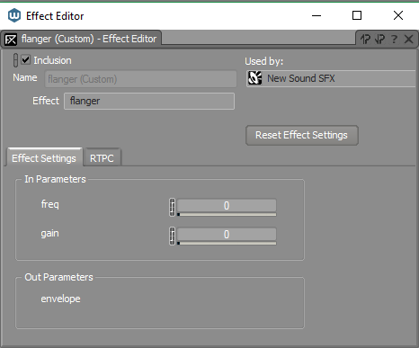
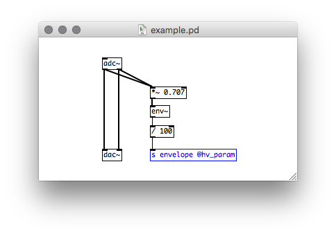
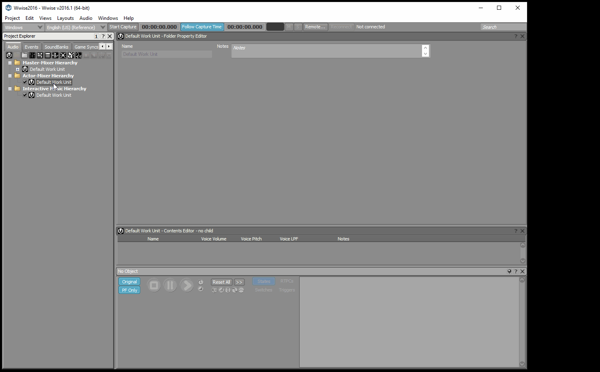

# Wwise

## Version Support

See the table below for heavy and Wwise version compatibility:

| heavy version | Wwise version |
| --- | --- |
| >= r2017.09 | Wwise 2017 |
| r2017.06 | Wwise 2016 |
| r2017.02 | Wwise 2016 |
| <= r2016.11 | Wwise 2015 |


## Source Generator or FX Unit

The type of plugin that **heavy** generates is dynamically determined depending on the [I/O channel configuration](#02.getting_started#audio-input-output).

If an `[adc~]` object exists in the patch the generated plugin with be an FX unit. Otherwise it'll be a source generator plugin.

## RTPCs

The Wwise target supports both [input and output parameters](#02.getting_started#exposing-parameters).



### Input Parameters
Exposing an input parameter will automatically generate a Slider UI in the plugin interface, that can then be connected to RTPCs from your game.

### Output Parameters

Sending a `single float value` to an output parameters will in turn cause the corresponding Global RTPC of the same name to be set.

This is useful for letting the plugins control other behaviours within the game system.

**Note**: it's important that the naming of the output parameter and the global RTPC set up in Wwise are exactly the same.

The example patch below describes a simple envelope follower:



## Authoring Plugin Installation

### Authoring Assets
The Authoring plugin is what shows up in the Wwise Authoring interface, you can assign this plugin to Sound SFX objects and hook up RTPCs to its parameters.

### Runtime Assets
The runtime components are used by the Wwise integration engine, these are the files that will be actually used by your game or application. We provide both a dynamic plugin that can be easily loaded into development engines like Unity and Unreal, as well a static library that can be compiled directly into the Wwise Integration.

### Windows Authoring 32bit
Take the following files found in the `Wwise Win32` target:

* `HV_{PATCH_NAME}_WwiseSourceAuthPlugin.dll`
* `HV_{PATCH_NAME}_WwiseSourceAuthPlugin.xml`

And place them in the following location:

* `C:\Program Files (x86)\Audiokinetic\Wwise 2017.1.0.6302\Authoring\Win32\Release\bin\plugins`

### Windows Authoring 64bit
Take the following files found in the `Wwise Win64` target:

* `HV_{PATCH_NAME}_WwiseSourceAuthPlugin.dll`
* `HV_{PATCH_NAME}_WwiseSourceAuthPlugin.xml`

And place them in one of the following locations:

* `C:\Program Files (x86)\Audiokinetic\Wwise 2017.1.0.6302\Authoring\x64\Release\bin\plugins`


### Mac OSX Authoring
The Wwise Authoring application for Mac OSX uses a Wine wrapper and therefore requires plugin binaries compiled for Windows.

Take the following files found in the `Wwise Win32` target:

* `HV_{PATCH_NAME}_WwiseSourceAuthPlugin.dll`
* `HV_{PATCH_NAME}_WwiseSourceAuthPlugin.xml`

And place them in the following location:

* `/Applications/Audiokinetic/Wwise 2017.1.0.6302/Wwise.app/Contents/SharedSupport/Wwise2016/support/wwise/drive_c/Program Files/Audiokinetic/Wwise/Authoring/Win32/Release/bin/plugins/`

After installing the plugins the Wine cache will need to be refreshed, in a command-line application like Terminal run the following commands:

```
cd "/Applications/Audiokinetic/Wwise 2017.1.0.6302/Wwise.app/Contents/SharedSupport/Wwise2017/"
```

```
CX_ROOT="/Applications/Audiokinetic/Wwise 2017.1.0.6302/Wwise.app/Contents/SharedSupport/Wwise2017/" WINEPREFIX="/Applications/Audiokinetic/Wwise 2017.1.0.6302/Wwise.app/Contents/SharedSupport/Wwise2017/support/wwise/" ./bin/wineprefixcreate --snapshot
```

Note: for different versions of Wwise make sure to edit the command text to include the relevant version string (`Wwise 2017.1.0.6302`).

## Adding a Source Plugin




## Unity Integration

### Setting up the projects

First create a new Wwise project, add a Source plugin to a game object, create an Event to trigger it and add it to a Soundbank.

Then create a new Unity project, add the Wwise Unity integration package, reference your Wwise authoring application and previously created project.

Add an empty GameObject to your scene, add an AKBank and AKEvent object and initialise them with ones created in your Wwise project.

After following the instructions below to install the plugin, make sure your soundbanks have been generated and press play in the Unity editor.

### Windows 32bit
From the `Wwise Windows 32bit` target take the following file:

* `HV_{PATCH_NAME}_WwiseSourcePlugin.dll`

And place it in the following directory:

* `{UNITY_PROJECT}/Assets/Wwise/Deployment/Plugins/Windows/x86/DSP/`

### Windows 64bit
From the `Wwise Windows 64bit` target take the following file:

* `HV_{PATCH_NAME}_WwiseSourcePlugin.dll`

And place it in the following directory:

* `{UNITY_PROJECT}/Assets/Wwise/Deployment/Plugins/Windows/x86_64/DSP/`

### Mac OSX
From the `Wwise macOS 64bit` target take the following file from the `/osx/x86_64/Release/` directory:

* `libHV_{PATCH_NAME}_WwiseSourcePlugin.bundle`

And place it in the following directory:

* `{UNITY_PROJECT}/Assets/Wwise/Deployment/Plugins/Mac/DSP/`

*Note: the Mac OSX builds are 64bit only.*

### iOS
From the `Wwise iOS armv7a` target take the downloaded files:

* `libHV_{PATCH_NAME}_WwiseSourcePluginFactory.h`
* `libHV_{PATCH_NAME}_WwiseSourcePlugin.a`

And place it in the following directory:

* `{UNITY_PROJECT}/Assets/Wwise/Deployment/Plugins/iOS/DSP/`

## Compiling the Plugin
Each platform has its own way of compiling the plugins.

### MacOS
An Xcode project exists in the `unity/xcode` directory and the plugin may be built manually. It can also be compiled directly from the commandline.
```bash
$ cd unity/xcode
$ xcodebuild -project Hv_heavy_WwiseSourcePlugin.xcodeproj -target Hv_heavy_WwiseSourcePlugin -arch x86_64
```
The results are placed in `unity/build/macos/x86_64/Release`.

### iOS
An Xcode project exists in the `unity/xcode` directory and the plugin may be built manually. It can also be compiled directly from the commandline.
```bash
$ cd unity/xcode
$ xcodebuild -project Hv_heavy_WwiseSourcePlugin.xcodeproj -target Hv_heavy_WwiseSourcePlugin -arch armv7s
```
The results are placed in `unity/build/macos/armv7s/Release`.

### Linux
```bash
$ cd unity/linux
$ make -j
```
The results are placed in `unity/build/linux/x86_64/release`.

### Windows
A Visual Studio 2015 project exists in the `unity/vs2015` directory and the plugin may be built manually. It can also be compiled directly from the commandline.
```bash
$ cd unity/vs2015
$ "C:/Program Files (x86)/MSBuild/14.0/Bin/MSBuild.exe" /property:Configuration=Release /property:Platform=x64 /t:Rebuild Hv_heavy_WwiseSourcePlugin.sln /m
```
The results are placed in `unity/build/win/x64/Release`.

Plugins for x86 may also be built by specifying `/property:Platform=x86`.
